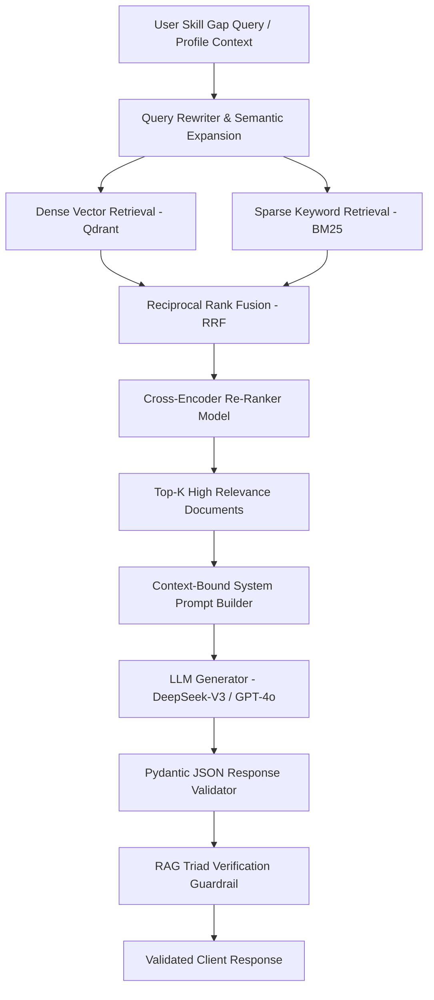

# RAG Architecture & AI Pipeline Specification — SkillBridge AI

> **Document ID:** RAG-SPEC-001  
> **Version:** 1.0.0  
> **Created:** 2026-10-06  
> **Status:** Approved Baseline Architecture  

---

## 1. RAG System Overview

SkillBridge AI utilizes a Advanced RAG (Retrieval-Augmented Generation) pipeline to drive personalized skill gap analysis, custom learning path roadmaps, and contextual interview questions.



---

## 2. Ingestion & Chunking Pipeline

### 2.1 Knowledge Base Taxonomy
The RAG Knowledge Base comprises:
1. **Industry Skill Standards:** Curated taxonomies from O*NET, ESCO, and Tech Stack benchmarks.
2. **Learning Curricula:** Structured learning modules, course descriptions, project tutorials, and documentation.
3. **Interview Question Repository:** Technical questions tagged by domain, difficulty, role, and evaluation criteria.

### 2.2 Chunking Strategy
- **Chunking Algorithm:** Hierarchical Markdown / Semantic Chunking.
- **Chunk Size:** 512 tokens with 64-token overlap ($12.5\%$).
- **Metadata Encoding:** Each chunk includes payload tags:
  ```json
  {
    "doc_id": "SKILL-PY-042",
    "category": "Backend Development",
    "skill_name": "FastAPI",
    "difficulty": "Intermediate",
    "source_url": "https://fastapi.tiangolo.com/tutorial/",
    "chunk_index": 3,
    "total_chunks": 12
  }
  ```

---

## 3. Embedding & Vector Database Architecture

- **Embedding Model:** `text-embedding-3-small` (1536 dimensions) or `bge-large-en-v1.5` (1024 dimensions).
- **Vector Database:** Qdrant Vector Store.
- **Index Configuration:** HNSW (Hierarchical Navigable Small World) with distance metric `Cosine`.
  - $M = 16$ (number of bi-directional links)
  - $ef\_construct = 128$

---

## 4. Hybrid Search & Re-ranking

1. **Hybrid Retrieval:**
   - **Dense Search (Cosine Similarity):** Captures semantic intent and skill concepts.
   - **Sparse Search (BM25):** Ensures exact matches for specific framework names, libraries, and tools (e.g., `PyTorch`, `Kafka`, `gRPC`).
2. **Fusion Algorithm:** Reciprocal Rank Fusion (RRF) with constant $k=60$:
   $$RRF\_Score(d) = \sum_{m \in M} \frac{1}{k + r_m(d)}$$
3. **Re-ranking Stage:**
   - Top 30 candidate chunks from RRF passed to `ms-marco-MiniLM-L-6-v2` cross-encoder.
   - Top $K=5$ highest scoring chunks selected for context window injection.

---

## 5. RAG Triad Evaluation Metrics

To guarantee academic defensibility and zero-hallucination standards, SkillBridge AI monitors three RAG metrics:

```
┌────────────────────────────────────────────────────────┐
│                   RAG Triad Metrics                    │
├───────────────────┬──────────────────┬─────────────────┤
│    Context        │   Groundedness   │     Answer      │
│   Relevance       │   (Faithfulness) │   Relevance     │
│  (Retrieved vs    │   (Generated vs  │  (Answer vs     │
│   User Prompt)    │    Context)      │   User Prompt)  │
└───────────────────┴──────────────────┴─────────────────┘
```

1. **Context Relevance Score ($\ge 0.85$):** Measures percentage of retrieved chunks actually relevant to the user query.
2. **Groundedness / Faithfulness Score ($\ge 0.90$):** Verifies every statement in the output is directly supported by retrieved context.
3. **Answer Relevance Score ($\ge 0.88$):** Ensures output addresses the user's specific request without tangential drift.

---

## 6. Prompt Engineering & Guardrail Template

```text
SYSTEM PROMPT:
You are the SkillBridge AI Career Advisor Engine.
Your task is to analyze the user's profile and generate an accurate, grounded career roadmap.

STRICT RULES:
1. ONLY use factual information present in the provided <context> tags.
2. DO NOT introduce external courses, tools, or concepts not present or supported by the context.
3. If the context does not provide sufficient information to fill a gap, explicitly state: "Insufficient context available for this specific skill."
4. Format all responses strictly as JSON matching the specified Schema.

<context>
{RETRIEVED_CHUNKS}
</context>

<user_profile>
{USER_PROFILE_JSON}
</user_profile>
```

---
*End of Document: RAG Architecture & AI Pipeline Specification*
