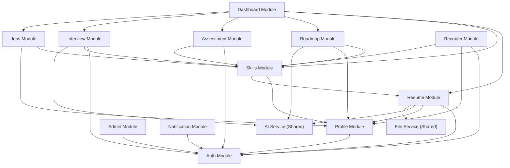

# System Architecture — SkillBridge AI

> **Document ID:** ARCH-001
> **Version:** 1.0.0
> **Created:** 2026-10-06
> **Status:** Accepted

---

## 1. Architecture Overview

SkillBridge AI uses a **Modular Monolith** architecture — a single deployable application with clearly separated internal modules, each owning its own routes, controllers, services, and data access logic.

### 1.1 Why Modular Monolith (Not Microservices)

| Factor | Modular Monolith | Microservices |
|--------|-----------------|---------------|
| Deployment complexity | Low (single app) | High (multiple services, orchestration) |
| Development speed | Fast (shared codebase) | Slower (inter-service communication) |
| Team size requirement | Small team feasible | Needs larger team |
| Data consistency | Simple (shared DB) | Complex (distributed transactions) |
| Debugging | Straightforward | Distributed tracing needed |
| Academic demonstrability | Clear, explainable | Over-engineered for scope |

**Decision:** Modular monolith is the correct choice. See ADR-002 for full rationale.

---

## 2. System Architecture Diagram

```
┌─────────────────────────────────────────────────────────────────────┐
│                          CLIENT TIER                                │
│                                                                     │
│  ┌───────────────────────────────────────────────────────────────┐   │
│  │              React SPA (Vite)                                │   │
│  │                                                               │   │
│  │  ┌────────┐ ┌────────┐ ┌────────┐ ┌────────┐ ┌────────┐     │   │
│  │  │  Auth  │ │ Resume │ │ Skills │ │  Dash  │ │Interview│    │   │
│  │  │  Pages │ │  Pages │ │ Pages  │ │  board │ │  Pages │     │   │
│  │  └────────┘ └────────┘ └────────┘ └────────┘ └────────┘     │   │
│  │                                                               │   │
│  │  ┌──────────────┐  ┌──────────────┐  ┌───────────────┐       │   │
│  │  │  API Client   │  │ Auth Context │  │  State Mgmt   │      │   │
│  │  │  (fetch/axios)│  │ (JWT Mgmt)   │  │  (Context)    │      │   │
│  │  └──────────────┘  └──────────────┘  └───────────────┘       │   │
│  └───────────────────────────────────────────────────────────────┘   │
│                              │ HTTPS / REST                         │
└──────────────────────────────┼──────────────────────────────────────┘
                               │
┌──────────────────────────────┼──────────────────────────────────────┐
│                         API TIER                                    │
│                              │                                      │
│  ┌───────────────────────────▼───────────────────────────────────┐   │
│  │                    Express.js Server                          │   │
│  │                                                               │   │
│  │  ┌─────────────────────────────────────────────────────────┐  │   │
│  │  │                    MIDDLEWARE LAYER                      │  │   │
│  │  │  CORS │ Helmet │ Rate Limit │ Auth │ Validation │ Error │  │   │
│  │  └─────────────────────────────────────────────────────────┘  │   │
│  │                                                               │   │
│  │  ┌─────────────────────────────────────────────────────────┐  │   │
│  │  │                    MODULE LAYER                          │  │   │
│  │  │                                                         │  │   │
│  │  │  ┌──────┐ ┌──────┐ ┌──────┐ ┌──────┐ ┌──────┐        │  │   │
│  │  │  │ Auth │ │Resume│ │Skills│ │Roads │ │Assess│        │  │   │
│  │  │  │Module│ │Module│ │Module│ │ Module│ │Module│        │  │   │
│  │  │  └──────┘ └──────┘ └──────┘ └──────┘ └──────┘        │  │   │
│  │  │                                                         │  │   │
│  │  │  ┌──────┐ ┌──────┐ ┌──────┐ ┌──────┐ ┌──────┐        │  │   │
│  │  │  │Intrv │ │ Jobs │ │Recrui│ │Admin │ │Notif │        │  │   │
│  │  │  │Module│ │Module│ │Module│ │Module│ │Module│        │  │   │
│  │  │  └──────┘ └──────┘ └──────┘ └──────┘ └──────┘        │  │   │
│  │  └─────────────────────────────────────────────────────────┘  │   │
│  │                                                               │   │
│  │  ┌─────────────────────────────────────────────────────────┐  │   │
│  │  │                  SHARED SERVICES                        │  │   │
│  │  │  AI Service │ File Service │ Email Service │ Logger     │  │   │
│  │  └─────────────────────────────────────────────────────────┘  │   │
│  └───────────────────────────────────────────────────────────────┘   │
│                    │                    │                            │
└────────────────────┼────────────────────┼────────────────────────────┘
                     │                    │
┌────────────────────┼────────────────────┼────────────────────────────┐
│                 DATA TIER              │                            │
│                    │                    │                            │
│  ┌─────────────────▼──────┐  ┌─────────▼──────────┐                │
│  │    PostgreSQL 15+      │  │     Redis 7+       │                │
│  │    (Prisma ORM)        │  │                    │                │
│  │                        │  │  • Session store   │                │
│  │  • Users & profiles    │  │  • Rate limit      │                │
│  │  • Resumes & analysis  │  │    counters        │                │
│  │  • Skills & gaps       │  │  • AI response     │                │
│  │  • Roadmaps            │  │    cache           │                │
│  │  • Assessments         │  │  • Temp data       │                │
│  │  • Interviews          │  │                    │                │
│  │  • Jobs & matches      │  │                    │                │
│  │  • Audit logs          │  │                    │                │
│  └────────────────────────┘  └────────────────────┘                │
│                                                                     │
└─────────────────────────────────────────────────────────────────────┘
                     │
                     │ HTTPS (outbound)
                     ▼
┌─────────────────────────────────────────────────────────────────────┐
│                     EXTERNAL SERVICES                               │
│                                                                     │
│  ┌────────────────────┐                                             │
│  │    OpenAI API       │  Resume analysis, skill extraction,       │
│  │    (GPT-4 / 3.5)   │  interview Q&A, roadmap generation        │
│  └────────────────────┘                                             │
│                                                                     │
└─────────────────────────────────────────────────────────────────────┘
```

---

## 3. Component Diagram

### 3.1 Module Internal Structure

Each feature module follows the same layered pattern:

```
Module (e.g., Resume)
├── resume.routes.js        ← Express route definitions
├── resume.controller.js    ← Request handling, response formatting
├── resume.service.js       ← Business logic
├── resume.repository.js    ← Data access (Prisma queries)
├── resume.validation.js    ← Input validation schemas (Zod)
├── resume.errors.js        ← Module-specific error classes
└── resume.test.js          ← Unit and integration tests
```

### 3.2 Request Flow

```
HTTP Request
    │
    ▼
Express Router ──→ Route Middleware (auth, validation)
    │
    ▼
Controller ──→ Parse request, call service, format response
    │
    ▼
Service ──→ Business logic, orchestrate operations
    │
    ├──→ Repository ──→ Prisma ──→ PostgreSQL
    │
    ├──→ AI Service ──→ OpenAI API
    │
    └──→ Other Services (file, cache, notification)
    │
    ▼
Response ──→ Consistent JSON envelope
```

### 3.3 Module Dependency Graph



---

## 4. Deployment Diagram

```
┌─────────────────────────────────────────────────────┐
│                 Development Machine                  │
│                                                     │
│  ┌─────────────────────┐                            │
│  │   Docker Compose     │                            │
│  │                     │                            │
│  │  ┌───────────────┐  │  ┌───────────────────┐     │
│  │  │  PostgreSQL    │  │  │   Vite Dev Server │     │
│  │  │  Container     │  │  │   (Port 5173)     │     │
│  │  │  (Port 5432)   │  │  │                   │     │
│  │  └───────────────┘  │  │   React SPA        │     │
│  │                     │  │   Hot Module Reload │     │
│  │  ┌───────────────┐  │  └───────────────────┘     │
│  │  │  Redis         │  │                            │
│  │  │  Container     │  │  ┌───────────────────┐     │
│  │  │  (Port 6379)   │  │  │   Node.js Server  │     │
│  │  └───────────────┘  │  │   (Port 3000)      │     │
│  │                     │  │                     │     │
│  └─────────────────────┘  │   Express API       │     │
│                           │   Nodemon (watch)    │     │
│                           └───────────────────┘     │
│                                                     │
└─────────────────────────────────────────────────────┘

┌─────────────────────────────────────────────────────┐
│              Production (Docker)                     │
│                                                     │
│  ┌─────────────────────────────────────────────┐     │
│  │           Docker Compose                    │     │
│  │                                             │     │
│  │  ┌─────────┐  ┌──────────┐  ┌───────────┐  │     │
│  │  │ App     │  │PostgreSQL│  │  Redis    │  │     │
│  │  │Container│  │Container │  │ Container │  │     │
│  │  │         │  │          │  │           │  │     │
│  │  │ Node.js │  │ Data Vol │  │           │  │     │
│  │  │ + React │  │          │  │           │  │     │
│  │  │ (built) │  │          │  │           │  │     │
│  │  │ :3000   │  │ :5432    │  │ :6379     │  │     │
│  │  └─────────┘  └──────────┘  └───────────┘  │     │
│  │                                             │     │
│  └─────────────────────────────────────────────┘     │
│                                                     │
└─────────────────────────────────────────────────────┘
```

---

## 5. Cross-Cutting Concerns

### 5.1 Authentication Flow

```
Client                    Server                    Database
  │                         │                          │
  │── POST /auth/login ────▶│                          │
  │   {email, password}     │── Find user ────────────▶│
  │                         │◀── User record ──────────│
  │                         │                          │
  │                         │── Verify bcrypt hash     │
  │                         │── Generate JWT (15min)   │
  │                         │── Generate Refresh (7d)  │
  │                         │── Store refresh token ──▶│
  │                         │                          │
  │◀── {accessToken} ──────│                          │
  │    Set-Cookie: refresh  │                          │
  │                         │                          │
  │── GET /api/v1/... ─────▶│                          │
  │   Authorization: Bearer │── Verify JWT             │
  │                         │── Extract userId, role   │
  │                         │── Check RBAC             │
  │                         │── Process request        │
  │◀── Response ────────────│                          │
```

### 5.2 AI Service Pattern

```
Module Service                AI Service               OpenAI
    │                            │                        │
    │── analyzeResume(text) ────▶│                        │
    │                            │── Build prompt         │
    │                            │── Validate input       │
    │                            │── Check cache ────────▶│ (Redis)
    │                            │                        │
    │                            │   [Cache miss]         │
    │                            │── Call OpenAI ────────▶│
    │                            │◀── Response ──────────│
    │                            │── Validate output      │
    │                            │── Parse structured     │
    │                            │── Cache result         │
    │◀── Structured result ─────│                        │
    │                            │                        │
    │   [AI Failure]             │                        │
    │◀── GracefulDegradation ───│                        │
    │   {error, fallbackData}    │                        │
```

### 5.3 Error Handling Chain

```
Error occurs in Service
    │
    ▼
Service throws typed Error (ValidationError, NotFoundError, etc.)
    │
    ▼
Controller catches, or error propagates to global handler
    │
    ▼
Global Error Handler Middleware
    │── Log error (structured, no PII)
    │── Map to HTTP status code
    │── Format consistent JSON response
    │── Strip stack trace in production
    │
    ▼
Client receives:
{
  "success": false,
  "error": {
    "code": "VALIDATION_ERROR",
    "message": "User-friendly message",
    "details": [...]
  }
}
```

---

## 6. Data Flow Overview

### 6.1 Resume Analysis Data Flow

```
┌──────┐    ┌─────────┐    ┌───────────┐    ┌──────────┐    ┌────────┐
│Upload│───▶│Validate │───▶│  Extract  │───▶│ Section  │───▶│  Skill │
│ File │    │File Type│    │   Text    │    │Detection │    │Extract │
└──────┘    │  & Size │    │(PDF/DOCX) │    │          │    │        │
            └─────────┘    └───────────┘    └──────────┘    └────────┘
                                                                 │
                                                                 ▼
┌──────────┐    ┌──────────┐    ┌──────────┐    ┌──────────────────┐
│Recommend │◀───│  Score   │◀───│ Analyze  │◀───│     AI          │
│ -ations  │    │          │    │ (AI+Rule)│    │   Analysis      │
└──────────┘    └──────────┘    └──────────┘    └──────────────────┘
     │
     ▼
┌──────────┐
│  Store   │
│ Results  │
└──────────┘
```

### 6.2 Career Intelligence Data Flow

```
┌──────────┐  ┌──────────┐  ┌──────────┐  ┌──────────┐
│  Resume  │  │  Skills  │  │  Assess  │  │Interview │
│ Analysis │  │   Data   │  │  Results │  │  Results │
└────┬─────┘  └────┬─────┘  └────┬─────┘  └────┬─────┘
     │             │             │              │
     └─────────────┴─────────────┴──────────────┘
                         │
                         ▼
              ┌─────────────────┐
              │   Dashboard     │
              │   Aggregation   │
              │   Service       │
              └────────┬────────┘
                       │
                       ▼
              ┌─────────────────┐
              │  Career Readiness│
              │  Computation     │
              └────────┬────────┘
                       │
         ┌─────────────┼─────────────┐
         ▼             ▼             ▼
   ┌──────────┐ ┌──────────┐ ┌──────────┐
   │Readiness │ │ Progress │ │  Next    │
   │  Score   │ │  Metrics │ │  Actions │
   └──────────┘ └──────────┘ └──────────┘
```

---

## 7. Security Architecture

### 7.1 Security Layers

```
┌─────────────────────────────────────────────────┐
│              TRANSPORT LAYER                     │
│              HTTPS / TLS                         │
├─────────────────────────────────────────────────┤
│              SECURITY HEADERS                    │
│              Helmet.js                           │
├─────────────────────────────────────────────────┤
│              RATE LIMITING                       │
│              express-rate-limit + Redis           │
├─────────────────────────────────────────────────┤
│              CORS                                │
│              Explicit origin whitelist            │
├─────────────────────────────────────────────────┤
│              AUTHENTICATION                      │
│              JWT verification                    │
├─────────────────────────────────────────────────┤
│              AUTHORIZATION                       │
│              RBAC middleware                      │
├─────────────────────────────────────────────────┤
│              INPUT VALIDATION                    │
│              Zod schemas                         │
├─────────────────────────────────────────────────┤
│              DATA SANITIZATION                   │
│              DOMPurify / sanitize-html            │
├─────────────────────────────────────────────────┤
│              PARAMETERIZED QUERIES               │
│              Prisma ORM (no raw SQL concat)       │
├─────────────────────────────────────────────────┤
│              AUDIT LOGGING                       │
│              Security-relevant event logging      │
└─────────────────────────────────────────────────┘
```

---

## 8. AI Architecture

### 8.1 AI Decision Matrix

| Task | Use AI? | Justification |
|------|---------|---------------|
| Resume text analysis & feedback | ✅ Yes | NLP required for nuanced evaluation |
| Skill extraction from text | ✅ Yes | NLP for entity extraction |
| Interview Q&A & feedback | ✅ Yes | Conversational, role-specific responses |
| Career roadmap generation | ✅ Yes | Personalized recommendations from multiple inputs |
| Job match explanation | ✅ Yes | Natural language reasoning about match |
| Authentication | ❌ No | Deterministic logic |
| Input validation | ❌ No | Schema-based rules |
| Score calculations | ❌ No | Deterministic formulas |
| Database operations | ❌ No | CRUD operations |
| RBAC checks | ❌ No | Role-based rules |
| File validation | ❌ No | MIME type / size checks |

### 8.2 AI Service Architecture

```
┌─────────────────────────────────────────────┐
│              AI Service Layer               │
│                                             │
│  ┌────────────────┐  ┌──────────────────┐   │
│  │ Prompt Manager  │  │  Output Parser   │   │
│  │                │  │                  │   │
│  │ • Templates    │  │ • JSON parsing   │   │
│  │ • Variables    │  │ • Validation     │   │
│  │ • Versioning   │  │ • Type coercion  │   │
│  └────────────────┘  └──────────────────┘   │
│                                             │
│  ┌────────────────┐  ┌──────────────────┐   │
│  │ Rate Limiter   │  │  Cache Layer     │   │
│  │                │  │  (Redis)         │   │
│  │ • Per user     │  │                  │   │
│  │ • Per endpoint │  │ • TTL per type   │   │
│  │ • Global       │  │ • Cache keys     │   │
│  └────────────────┘  └──────────────────┘   │
│                                             │
│  ┌────────────────┐  ┌──────────────────┐   │
│  │ Error Handler  │  │  Fallback        │   │
│  │                │  │  Strategy        │   │
│  │ • Retry logic  │  │                  │   │
│  │ • Timeout      │  │ • Cached result  │   │
│  │ • Circuit break│  │ • Partial result │   │
│  └────────────────┘  │ • Error message  │   │
│                      └──────────────────┘   │
└─────────────────────────────────────────────┘
```

### 8.3 RAG Decision

**Current Decision:** RAG will **not** be implemented in the initial architecture.

**Rationale:**
- The platform does not have a large, evolving knowledge corpus that requires retrieval-augmented generation.
- Career guidance and skill recommendations can be effectively generated using structured prompts with contextual data (user profile, resume, skill taxonomy).
- The skill taxonomy and learning resources are structured data, better served by database queries than vector search.
- Adding RAG would introduce significant complexity (vector database, embedding pipeline, chunking strategy) without proportional value for this scope.
- OpenAI's GPT models have sufficient general knowledge about careers, skills, and industry requirements.

**Future Consideration:** If the platform scales to include a large corpus of curated career resources, university-specific content, or industry reports, RAG should be reconsidered. This decision is documented in ADR-004.

---

## 9. Technology Architecture Summary

| Layer | Technology | Port | Purpose |
|-------|-----------|------|---------|
| Frontend | React 18 + Vite 5 | 5173 | SPA, UI components |
| Styling | Vanilla CSS + CSS Modules | — | Styling, responsive design |
| API Server | Node.js 20 + Express 4 | 3000 | REST API, business logic |
| Database | PostgreSQL 15 | 5432 | Persistent data |
| ORM | Prisma 5 | — | Type-safe queries, migrations |
| Cache | Redis 7 | 6379 | Sessions, rate limits, AI cache |
| AI | OpenAI API (GPT-4/3.5) | — | NLP features |
| Auth | JWT + bcrypt | — | Authentication |
| Validation | Zod | — | Schema validation |
| Testing | Jest + Supertest + Playwright | — | Unit, integration, E2E |
| Linting | ESLint + Prettier | — | Code quality |
| Containers | Docker + Docker Compose | — | Infrastructure |
