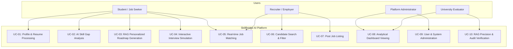
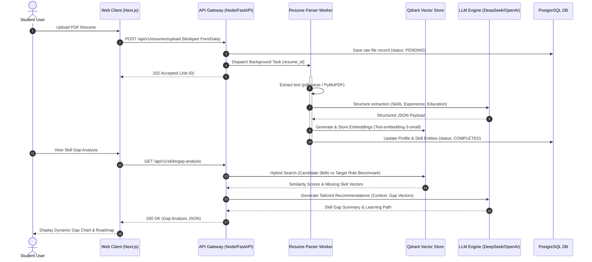
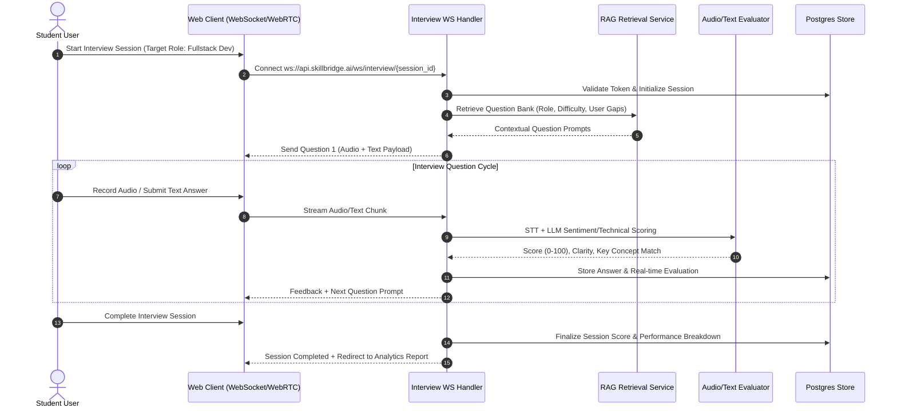
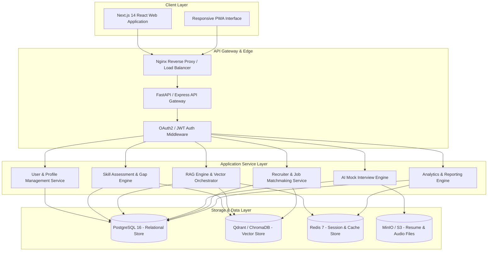
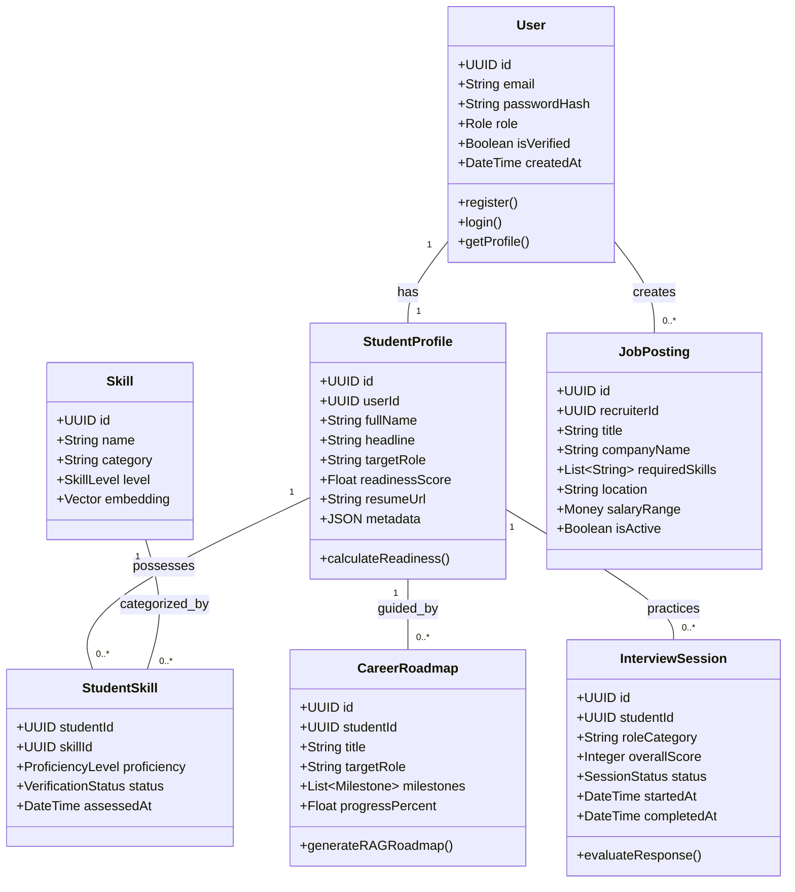
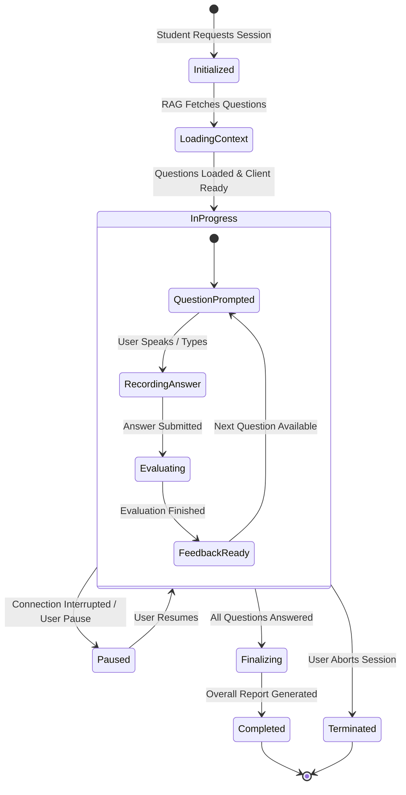

# Visual & UML Architecture Diagrams — SkillBridge AI

> **Document ID:** ARCH-UML-001  
> **Version:** 1.0.0  
> **Created:** 2026-10-06  
> **Status:** Approved Baseline  

---

## 1. System Use Case Diagram



---

## 2. Dynamic Sequence Diagrams

### 2.1 Sequence 01: Resume Upload & RAG Skill Gap Analysis Workflow



### 2.2 Sequence 02: AI Interview Simulator Loop



---

## 3. Structural Component Architecture Diagram



---

## 4. Class & Data Entity Diagram



---

## 5. State Machine Diagrams

### 5.1 Interview Session State Transition



---

## 6. Physical Deployment Architecture

```mermaid
graph TD
    subgraph Client Environment
        Browser[Modern Web Browser Chrome/Firefox/Safari]
    end

    subgraph AWS / Cloud Infrastructure / Docker Swarm
        subgraph Ingress / Security Boundary
            ALB[Application Load Balancer / TLS Ingress]
            WAF[AWS WAF / Cloudflare DDoS Protection]
        end

        subgraph Container Cluster (Kubernetes / Docker Compose)
            Pod1[Web Frontend App Node 1]
            Pod2[Web Frontend App Node 2]
            Pod3[FastAPI Backend Engine Pod 1]
            Pod4[FastAPI Backend Engine Pod 2]
            Pod5[Celery / Async Task Worker Pod]
        end

        subgraph Managed Data Services
            RDS[(AWS RDS PostgreSQL Multi-AZ)]
            QdrantCloud[(Qdrant Vector DB Cluster)]
            RedisCluster[(ElastiCache Redis Cluster)]
            S3Bucket[(AWS S3 Object Store - Media/Resumes)]
        end
    end

    Browser --> WAF
    WAF --> ALB
    ALB --> Pod1
    ALB --> Pod2
    Pod1 --> Pod3
    Pod2 --> Pod4
    Pod3 --> Pod5
    Pod4 --> Pod5

    Pod3 --> RDS
    Pod4 --> RDS
    Pod3 --> QdrantCloud
    Pod4 --> QdrantCloud
    Pod3 --> RedisCluster
    Pod4 --> RedisCluster
    Pod5 --> S3Bucket
```

---
*End of Document: Visual & UML Architecture Diagrams*
