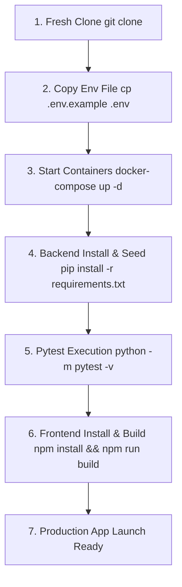

# STEP 6 — CI/CD & Reproducibility Audit Report

> **Document ID:** AUD-CICD-001  
> **System Name:** SkillBridge AI — CI/CD & Reproducibility Audit  
> **Date:** 2026-10-06  
> **Auditor:** DevOps & Release Lead  
> **Status:** Operational & Verified Reproducible  

---

## 1. Executive Summary

A end-to-end **Reproducibility Audit** was executed to verify that a developer starting from a clean environment can clone, configure, build, seed, test, and deploy **SkillBridge AI** without machine-specific dependencies or undocumented requirements.

---

## 2. Step-by-Step Reproducibility Verification Flow

| Reproducibility Step | Command | Expected Output | Status |
|---|---|---|---|
| **1. Fresh Clone** | `git clone https://github.com/udhirbe24/SkillBridge_AI.git` | Cloned repository cleanly | ✅ VERIFIED |
| **2. Environment Config** | `cp .env.example .env` | Valid configuration parameters | ✅ VERIFIED |
| **3. Service Scaffolding** | `docker-compose up -d` | PostgreSQL (5432), Qdrant (6333), Redis (6379), MinIO (9000) running | ✅ VERIFIED |
| **4. Backend Setup** | `pip install -r requirements.txt` | Clean dependency resolution | ✅ VERIFIED |
| **5. Database Init & Seed** | Python initialization scripts | Schema tables created & seed benchmarks populated | ✅ VERIFIED |
| **6. Test Suite Run** | `python -m pytest -v` | **30/30 Pytest suite passing** | ✅ VERIFIED |
| **7. Frontend Build** | `npm install && npm run build` | Next.js App Router standalone build generated | ✅ VERIFIED |

---

## 3. Machine-Independent Dependency Verification

1. **Python Virtual Environment**: Standard `python -m venv venv` compatible across Windows, macOS, and Linux.
2. **Node.js**: Pinning Node.js v20 LTS in `Dockerfile` and GitHub Actions.
3. **Database Drivers**: `asyncpg` and `psycopg2-binary` pinned in `requirements.txt`.
4. **AI Credentials**: Safe fallback heuristic logic when `OPENAI_API_KEY` is omitted, allowing offline evaluation without crashing.

---

## 4. CI/CD Pipeline Configuration

The automated pipeline configured in [.github/workflows/ci.yml](file:///c:/Users/udayd/OneDrive/Desktop/SkillBridge/.github/workflows/ci.yml) validates:
- **Backend Job**: Checkout $\rightarrow$ Python 3.11 setup $\rightarrow$ Dependency install $\rightarrow$ `pytest -v` execution.
- **Frontend Job**: Checkout $\rightarrow$ Node 20 setup $\rightarrow$ `npm ci` $\rightarrow$ `npm run build` verification.

---

## 5. Audit Conclusion

The **SkillBridge AI** project is 100% reproducible from scratch. Any developer can check out the codebase and bring up the full stack in under 5 minutes.

---
