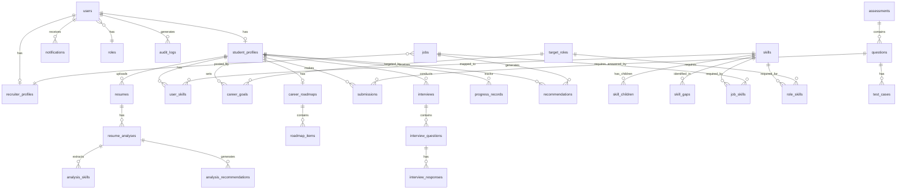

# Database Design — SkillBridge AI

> **Document ID:** DB-001
> **Version:** 1.0.0
> **Created:** 2026-10-06
> **Status:** Baseline

---

## 1. Design Principles

- Normalized to 3NF (Third Normal Form) minimum
- Foreign key constraints enforced at database level
- Timestamps (`created_at`, `updated_at`) on all tables
- Soft deletes where data retention is required (`deleted_at`)
- UUID primary keys for security (no sequential ID exposure)
- snake_case naming for all tables and columns
- Plural table names

---

## 2. Entity-Relationship Diagram

---

## 3. Table Definitions

### 3.1 Core User Tables

#### `roles`
| Column | Type | Constraints | Description |
|--------|------|-------------|-------------|
| id | UUID | PK, DEFAULT uuid_generate_v4() | Role identifier |
| name | VARCHAR(50) | UNIQUE, NOT NULL | Role name (student, recruiter, admin) |
| description | TEXT | | Role description |
| created_at | TIMESTAMPTZ | DEFAULT NOW() | Creation timestamp |

#### `users`
| Column | Type | Constraints | Description |
|--------|------|-------------|-------------|
| id | UUID | PK, DEFAULT uuid_generate_v4() | User identifier |
| email | VARCHAR(255) | UNIQUE, NOT NULL | Email address |
| password_hash | VARCHAR(255) | NOT NULL | bcrypt hash |
| first_name | VARCHAR(100) | NOT NULL | First name |
| last_name | VARCHAR(100) | NOT NULL | Last name |
| role_id | UUID | FK → roles(id), NOT NULL | User role |
| is_active | BOOLEAN | DEFAULT true | Account status |
| is_locked | BOOLEAN | DEFAULT false | Account lock status |
| failed_login_attempts | INTEGER | DEFAULT 0 | Failed login counter |
| locked_until | TIMESTAMPTZ | | Lock expiration |
| last_login_at | TIMESTAMPTZ | | Last login timestamp |
| created_at | TIMESTAMPTZ | DEFAULT NOW() | Creation timestamp |
| updated_at | TIMESTAMPTZ | DEFAULT NOW() | Last update |
| deleted_at | TIMESTAMPTZ | | Soft delete timestamp |

**Indexes:**
- `idx_users_email` on `email`
- `idx_users_role_id` on `role_id`
- `idx_users_is_active` on `is_active`

#### `refresh_tokens`
| Column | Type | Constraints | Description |
|--------|------|-------------|-------------|
| id | UUID | PK | Token identifier |
| user_id | UUID | FK → users(id), NOT NULL | Token owner |
| token_hash | VARCHAR(255) | NOT NULL | Hashed refresh token |
| expires_at | TIMESTAMPTZ | NOT NULL | Expiration time |
| is_revoked | BOOLEAN | DEFAULT false | Revocation status |
| created_at | TIMESTAMPTZ | DEFAULT NOW() | Creation timestamp |

### 3.2 Profile Tables

#### `student_profiles`
| Column | Type | Constraints | Description |
|--------|------|-------------|-------------|
| id | UUID | PK | Profile identifier |
| user_id | UUID | FK → users(id), UNIQUE, NOT NULL | Profile owner |
| bio | TEXT | | Personal bio |
| university | VARCHAR(255) | | University name |
| degree | VARCHAR(255) | | Degree program |
| field_of_study | VARCHAR(255) | | Field/Major |
| graduation_year | INTEGER | | Expected graduation |
| location | VARCHAR(255) | | Location |
| github_url | VARCHAR(500) | | GitHub profile |
| linkedin_url | VARCHAR(500) | | LinkedIn profile |
| portfolio_url | VARCHAR(500) | | Portfolio website |
| created_at | TIMESTAMPTZ | DEFAULT NOW() | |
| updated_at | TIMESTAMPTZ | DEFAULT NOW() | |

#### `education_records`
| Column | Type | Constraints | Description |
|--------|------|-------------|-------------|
| id | UUID | PK | Record identifier |
| student_profile_id | UUID | FK → student_profiles(id), NOT NULL | Profile reference |
| institution | VARCHAR(255) | NOT NULL | Institution name |
| degree | VARCHAR(255) | NOT NULL | Degree type |
| field | VARCHAR(255) | | Field of study |
| gpa | DECIMAL(3,2) | | GPA |
| start_date | DATE | | Start date |
| end_date | DATE | | End date |
| is_current | BOOLEAN | DEFAULT false | Currently attending |
| created_at | TIMESTAMPTZ | DEFAULT NOW() | |

#### `experience_records`
| Column | Type | Constraints | Description |
|--------|------|-------------|-------------|
| id | UUID | PK | Record identifier |
| student_profile_id | UUID | FK → student_profiles(id), NOT NULL | Profile reference |
| company | VARCHAR(255) | NOT NULL | Company name |
| title | VARCHAR(255) | NOT NULL | Job title |
| description | TEXT | | Job description |
| start_date | DATE | | Start date |
| end_date | DATE | | End date |
| is_current | BOOLEAN | DEFAULT false | Currently employed |
| created_at | TIMESTAMPTZ | DEFAULT NOW() | |

#### `recruiter_profiles`
| Column | Type | Constraints | Description |
|--------|------|-------------|-------------|
| id | UUID | PK | Profile identifier |
| user_id | UUID | FK → users(id), UNIQUE, NOT NULL | Profile owner |
| company_name | VARCHAR(255) | NOT NULL | Company |
| company_website | VARCHAR(500) | | Website |
| position | VARCHAR(255) | | Recruiter's position |
| bio | TEXT | | Company/recruiter bio |
| created_at | TIMESTAMPTZ | DEFAULT NOW() | |
| updated_at | TIMESTAMPTZ | DEFAULT NOW() | |

### 3.3 Resume Tables

#### `resumes`
| Column | Type | Constraints | Description |
|--------|------|-------------|-------------|
| id | UUID | PK | Resume identifier |
| student_profile_id | UUID | FK → student_profiles(id), NOT NULL | Resume owner |
| original_filename | VARCHAR(255) | NOT NULL | Uploaded filename |
| stored_filename | VARCHAR(255) | NOT NULL | Server filename |
| file_path | VARCHAR(500) | NOT NULL | Storage path |
| file_size | INTEGER | NOT NULL | File size in bytes |
| mime_type | VARCHAR(100) | NOT NULL | MIME type |
| extracted_text | TEXT | | Extracted raw text |
| is_primary | BOOLEAN | DEFAULT false | Primary resume flag |
| created_at | TIMESTAMPTZ | DEFAULT NOW() | |
| updated_at | TIMESTAMPTZ | DEFAULT NOW() | |

#### `resume_analyses`
| Column | Type | Constraints | Description |
|--------|------|-------------|-------------|
| id | UUID | PK | Analysis identifier |
| resume_id | UUID | FK → resumes(id), NOT NULL | Analyzed resume |
| overall_score | DECIMAL(5,2) | | Overall ATS-oriented score (0-100) |
| keyword_score | DECIMAL(5,2) | | Keyword relevance score |
| structure_score | DECIMAL(5,2) | | Structure/formatting score |
| completeness_score | DECIMAL(5,2) | | Content completeness score |
| readability_score | DECIMAL(5,2) | | Readability score |
| experience_score | DECIMAL(5,2) | | Experience relevance score |
| sections_detected | JSONB | | Detected sections with content |
| contact_info | JSONB | | Extracted contact information |
| education_extracted | JSONB | | Extracted education details |
| experience_extracted | JSONB | | Extracted experience details |
| projects_extracted | JSONB | | Extracted projects |
| certifications_extracted | JSONB | | Extracted certifications |
| raw_ai_response | JSONB | | Full AI response (for debugging) |
| analysis_version | VARCHAR(20) | | Version of analysis algorithm |
| created_at | TIMESTAMPTZ | DEFAULT NOW() | |

#### `analysis_skills`
| Column | Type | Constraints | Description |
|--------|------|-------------|-------------|
| id | UUID | PK | |
| resume_analysis_id | UUID | FK → resume_analyses(id), NOT NULL | Analysis reference |
| skill_name | VARCHAR(255) | NOT NULL | Skill as extracted |
| skill_id | UUID | FK → skills(id) | Matched taxonomy skill |
| confidence | DECIMAL(3,2) | | Extraction confidence |
| source_section | VARCHAR(100) | | Section where found |

#### `analysis_recommendations`
| Column | Type | Constraints | Description |
|--------|------|-------------|-------------|
| id | UUID | PK | |
| resume_analysis_id | UUID | FK → resume_analyses(id), NOT NULL | |
| category | VARCHAR(100) | NOT NULL | Recommendation category |
| priority | VARCHAR(20) | NOT NULL | high, medium, low |
| title | VARCHAR(255) | NOT NULL | Short recommendation |
| description | TEXT | NOT NULL | Detailed recommendation |
| created_at | TIMESTAMPTZ | DEFAULT NOW() | |

#### `job_description_matches`
| Column | Type | Constraints | Description |
|--------|------|-------------|-------------|
| id | UUID | PK | |
| resume_id | UUID | FK → resumes(id), NOT NULL | |
| job_description_text | TEXT | NOT NULL | JD content |
| job_title | VARCHAR(255) | | JD title |
| match_score | DECIMAL(5,2) | NOT NULL | Overall match % |
| matching_skills | JSONB | | Skills that match |
| missing_skills | JSONB | | Skills that are missing |
| matching_experience | JSONB | | Relevant experience |
| missing_keywords | JSONB | | Missing keywords |
| improvement_priorities | JSONB | | Prioritized improvements |
| explanation | TEXT | | Score explanation |
| created_at | TIMESTAMPTZ | DEFAULT NOW() | |

### 3.4 Skill Tables

#### `skills`
| Column | Type | Constraints | Description |
|--------|------|-------------|-------------|
| id | UUID | PK | Skill identifier |
| name | VARCHAR(255) | NOT NULL | Skill name |
| category | VARCHAR(100) | NOT NULL | technical, soft, domain |
| parent_id | UUID | FK → skills(id) | Parent skill (for hierarchy) |
| description | TEXT | | Skill description |
| is_active | BOOLEAN | DEFAULT true | Active in taxonomy |
| created_at | TIMESTAMPTZ | DEFAULT NOW() | |
| updated_at | TIMESTAMPTZ | DEFAULT NOW() | |

**Indexes:** `idx_skills_category`, `idx_skills_parent_id`, `idx_skills_name`

#### `target_roles`
| Column | Type | Constraints | Description |
|--------|------|-------------|-------------|
| id | UUID | PK | Role identifier |
| title | VARCHAR(255) | UNIQUE, NOT NULL | Role title |
| description | TEXT | | Role description |
| industry | VARCHAR(255) | | Industry sector |
| experience_level | VARCHAR(50) | | entry, mid, senior |
| is_active | BOOLEAN | DEFAULT true | |
| created_at | TIMESTAMPTZ | DEFAULT NOW() | |

#### `role_skills`
| Column | Type | Constraints | Description |
|--------|------|-------------|-------------|
| id | UUID | PK | |
| target_role_id | UUID | FK → target_roles(id), NOT NULL | |
| skill_id | UUID | FK → skills(id), NOT NULL | |
| importance | VARCHAR(20) | NOT NULL | required, preferred, nice_to_have |
| proficiency_level | VARCHAR(20) | | beginner, intermediate, advanced |
| UNIQUE | | (target_role_id, skill_id) | |

#### `user_skills`
| Column | Type | Constraints | Description |
|--------|------|-------------|-------------|
| id | UUID | PK | |
| student_profile_id | UUID | FK → student_profiles(id), NOT NULL | |
| skill_id | UUID | FK → skills(id), NOT NULL | |
| proficiency_level | VARCHAR(20) | DEFAULT 'beginner' | beginner, intermediate, advanced |
| source | VARCHAR(50) | NOT NULL | resume, assessment, manual |
| verified | BOOLEAN | DEFAULT false | Verified by assessment |
| last_assessed_at | TIMESTAMPTZ | | |
| created_at | TIMESTAMPTZ | DEFAULT NOW() | |
| updated_at | TIMESTAMPTZ | DEFAULT NOW() | |
| UNIQUE | | (student_profile_id, skill_id) | |

#### `skill_gaps`
| Column | Type | Constraints | Description |
|--------|------|-------------|-------------|
| id | UUID | PK | |
| student_profile_id | UUID | FK → student_profiles(id), NOT NULL | |
| skill_id | UUID | FK → skills(id), NOT NULL | |
| target_role_id | UUID | FK → target_roles(id), NOT NULL | |
| current_level | VARCHAR(20) | | Current proficiency |
| required_level | VARCHAR(20) | NOT NULL | Required proficiency |
| priority | INTEGER | DEFAULT 0 | Learning priority rank |
| created_at | TIMESTAMPTZ | DEFAULT NOW() | |
| updated_at | TIMESTAMPTZ | DEFAULT NOW() | |

### 3.5 Career Roadmap Tables

#### `career_goals`
| Column | Type | Constraints | Description |
|--------|------|-------------|-------------|
| id | UUID | PK | |
| student_profile_id | UUID | FK → student_profiles(id), NOT NULL | |
| target_role_id | UUID | FK → target_roles(id) | |
| description | TEXT | | Goal description |
| target_date | DATE | | Target achievement date |
| is_active | BOOLEAN | DEFAULT true | |
| created_at | TIMESTAMPTZ | DEFAULT NOW() | |
| updated_at | TIMESTAMPTZ | DEFAULT NOW() | |

#### `career_roadmaps`
| Column | Type | Constraints | Description |
|--------|------|-------------|-------------|
| id | UUID | PK | |
| student_profile_id | UUID | FK → student_profiles(id), NOT NULL | |
| career_goal_id | UUID | FK → career_goals(id), NOT NULL | |
| title | VARCHAR(255) | NOT NULL | Roadmap title |
| description | TEXT | | Roadmap description |
| total_items | INTEGER | DEFAULT 0 | Total items count |
| completed_items | INTEGER | DEFAULT 0 | Completed items count |
| progress_percentage | DECIMAL(5,2) | DEFAULT 0 | Progress % |
| generated_by | VARCHAR(20) | DEFAULT 'ai' | ai, manual |
| created_at | TIMESTAMPTZ | DEFAULT NOW() | |
| updated_at | TIMESTAMPTZ | DEFAULT NOW() | |

#### `roadmap_items`
| Column | Type | Constraints | Description |
|--------|------|-------------|-------------|
| id | UUID | PK | |
| career_roadmap_id | UUID | FK → career_roadmaps(id), NOT NULL | |
| skill_id | UUID | FK → skills(id) | Related skill |
| order_index | INTEGER | NOT NULL | Display order |
| title | VARCHAR(255) | NOT NULL | Item title |
| objective | TEXT | | Learning objective |
| action | TEXT | | Recommended action |
| resource_url | VARCHAR(500) | | Resource link |
| resource_title | VARCHAR(255) | | Resource name |
| assessment_id | UUID | FK → assessments(id) | Related assessment |
| status | VARCHAR(20) | DEFAULT 'not_started' | not_started, in_progress, completed |
| completed_at | TIMESTAMPTZ | | Completion timestamp |
| created_at | TIMESTAMPTZ | DEFAULT NOW() | |
| updated_at | TIMESTAMPTZ | DEFAULT NOW() | |

### 3.6 Assessment Tables

#### `assessments`
| Column | Type | Constraints | Description |
|--------|------|-------------|-------------|
| id | UUID | PK | |
| title | VARCHAR(255) | NOT NULL | Assessment title |
| description | TEXT | | Assessment description |
| topic | VARCHAR(100) | NOT NULL | Topic area |
| difficulty | VARCHAR(20) | NOT NULL | easy, medium, hard |
| time_limit_minutes | INTEGER | | Time limit |
| total_questions | INTEGER | DEFAULT 0 | Question count |
| is_active | BOOLEAN | DEFAULT true | |
| created_by | UUID | FK → users(id) | |
| created_at | TIMESTAMPTZ | DEFAULT NOW() | |
| updated_at | TIMESTAMPTZ | DEFAULT NOW() | |

#### `questions`
| Column | Type | Constraints | Description |
|--------|------|-------------|-------------|
| id | UUID | PK | |
| assessment_id | UUID | FK → assessments(id), NOT NULL | |
| title | VARCHAR(500) | NOT NULL | Question title |
| description | TEXT | NOT NULL | Full question text |
| topic | VARCHAR(100) | NOT NULL | Topic |
| difficulty | VARCHAR(20) | NOT NULL | easy, medium, hard |
| question_type | VARCHAR(50) | NOT NULL | coding, multiple_choice, short_answer |
| starter_code | TEXT | | Code template |
| expected_output_format | TEXT | | Expected output description |
| points | INTEGER | DEFAULT 1 | Point value |
| order_index | INTEGER | | Display order |
| created_at | TIMESTAMPTZ | DEFAULT NOW() | |

#### `test_cases`
| Column | Type | Constraints | Description |
|--------|------|-------------|-------------|
| id | UUID | PK | |
| question_id | UUID | FK → questions(id), NOT NULL | |
| input | TEXT | NOT NULL | Test input |
| expected_output | TEXT | NOT NULL | Expected output |
| is_hidden | BOOLEAN | DEFAULT false | Hidden from user |
| order_index | INTEGER | | |
| created_at | TIMESTAMPTZ | DEFAULT NOW() | |

#### `submissions`
| Column | Type | Constraints | Description |
|--------|------|-------------|-------------|
| id | UUID | PK | |
| student_profile_id | UUID | FK → student_profiles(id), NOT NULL | |
| question_id | UUID | FK → questions(id), NOT NULL | |
| assessment_id | UUID | FK → assessments(id), NOT NULL | |
| code | TEXT | NOT NULL | Submitted code |
| language | VARCHAR(50) | | Programming language |
| score | DECIMAL(5,2) | | Score achieved |
| passed_test_cases | INTEGER | DEFAULT 0 | Tests passed |
| total_test_cases | INTEGER | DEFAULT 0 | Total tests |
| time_spent_seconds | INTEGER | | Time spent |
| status | VARCHAR(20) | DEFAULT 'submitted' | submitted, evaluated, error |
| feedback | TEXT | | Evaluation feedback |
| created_at | TIMESTAMPTZ | DEFAULT NOW() | |

### 3.7 Interview Tables

#### `interviews`
| Column | Type | Constraints | Description |
|--------|------|-------------|-------------|
| id | UUID | PK | |
| student_profile_id | UUID | FK → student_profiles(id), NOT NULL | |
| target_role_id | UUID | FK → target_roles(id) | |
| role_title | VARCHAR(255) | NOT NULL | Interview role |
| difficulty | VARCHAR(20) | NOT NULL | easy, medium, hard |
| status | VARCHAR(20) | DEFAULT 'in_progress' | in_progress, completed |
| overall_score | DECIMAL(5,2) | | Overall performance |
| total_questions | INTEGER | DEFAULT 0 | |
| improvement_plan | JSONB | | AI-generated improvement plan |
| created_at | TIMESTAMPTZ | DEFAULT NOW() | |
| completed_at | TIMESTAMPTZ | | |

#### `interview_questions`
| Column | Type | Constraints | Description |
|--------|------|-------------|-------------|
| id | UUID | PK | |
| interview_id | UUID | FK → interviews(id), NOT NULL | |
| question_text | TEXT | NOT NULL | AI-generated question |
| question_type | VARCHAR(50) | | technical, behavioral, situational |
| order_index | INTEGER | NOT NULL | Question order |
| created_at | TIMESTAMPTZ | DEFAULT NOW() | |

#### `interview_responses`
| Column | Type | Constraints | Description |
|--------|------|-------------|-------------|
| id | UUID | PK | |
| interview_question_id | UUID | FK → interview_questions(id), NOT NULL | |
| response_text | TEXT | NOT NULL | User's response |
| score | DECIMAL(5,2) | | Response score |
| correctness_score | DECIMAL(5,2) | | Technical correctness |
| relevance_score | DECIMAL(5,2) | | Relevance to question |
| completeness_score | DECIMAL(5,2) | | Answer completeness |
| communication_score | DECIMAL(5,2) | | Communication quality |
| feedback | TEXT | | AI feedback |
| suggested_improvements | JSONB | | Improvement suggestions |
| created_at | TIMESTAMPTZ | DEFAULT NOW() | |

### 3.8 Job Tables

#### `jobs`
| Column | Type | Constraints | Description |
|--------|------|-------------|-------------|
| id | UUID | PK | |
| recruiter_profile_id | UUID | FK → recruiter_profiles(id) | Posting recruiter |
| title | VARCHAR(255) | NOT NULL | Job title |
| company | VARCHAR(255) | NOT NULL | Company name |
| description | TEXT | NOT NULL | Job description |
| location | VARCHAR(255) | | Location |
| job_type | VARCHAR(50) | | full_time, part_time, internship, contract |
| experience_level | VARCHAR(50) | | entry, mid, senior |
| salary_range | VARCHAR(100) | | Salary range |
| application_url | VARCHAR(500) | | Application link |
| is_active | BOOLEAN | DEFAULT true | |
| posted_at | TIMESTAMPTZ | DEFAULT NOW() | |
| expires_at | TIMESTAMPTZ | | |
| created_at | TIMESTAMPTZ | DEFAULT NOW() | |
| updated_at | TIMESTAMPTZ | DEFAULT NOW() | |

#### `job_skills`
| Column | Type | Constraints | Description |
|--------|------|-------------|-------------|
| id | UUID | PK | |
| job_id | UUID | FK → jobs(id), NOT NULL | |
| skill_id | UUID | FK → skills(id), NOT NULL | |
| importance | VARCHAR(20) | DEFAULT 'required' | required, preferred |
| UNIQUE | | (job_id, skill_id) | |

#### `recommendations`
| Column | Type | Constraints | Description |
|--------|------|-------------|-------------|
| id | UUID | PK | |
| student_profile_id | UUID | FK → student_profiles(id), NOT NULL | |
| job_id | UUID | FK → jobs(id), NOT NULL | |
| match_score | DECIMAL(5,2) | NOT NULL | Match percentage |
| matching_skills | JSONB | | Matched skills |
| missing_skills | JSONB | | Missing skills |
| explanation | TEXT | | Why recommended |
| is_dismissed | BOOLEAN | DEFAULT false | User dismissed |
| created_at | TIMESTAMPTZ | DEFAULT NOW() | |

### 3.9 System Tables

#### `notifications`
| Column | Type | Constraints | Description |
|--------|------|-------------|-------------|
| id | UUID | PK | |
| user_id | UUID | FK → users(id), NOT NULL | |
| type | VARCHAR(50) | NOT NULL | Notification type |
| title | VARCHAR(255) | NOT NULL | Notification title |
| message | TEXT | NOT NULL | Notification body |
| data | JSONB | | Additional data |
| is_read | BOOLEAN | DEFAULT false | Read status |
| created_at | TIMESTAMPTZ | DEFAULT NOW() | |

#### `progress_records`
| Column | Type | Constraints | Description |
|--------|------|-------------|-------------|
| id | UUID | PK | |
| student_profile_id | UUID | FK → student_profiles(id), NOT NULL | |
| record_type | VARCHAR(50) | NOT NULL | Type of progress |
| record_data | JSONB | NOT NULL | Progress snapshot |
| recorded_at | TIMESTAMPTZ | DEFAULT NOW() | |

#### `audit_logs`
| Column | Type | Constraints | Description |
|--------|------|-------------|-------------|
| id | UUID | PK | |
| user_id | UUID | FK → users(id) | Acting user |
| action | VARCHAR(100) | NOT NULL | Action performed |
| resource_type | VARCHAR(100) | NOT NULL | Resource affected |
| resource_id | UUID | | Resource identifier |
| details | JSONB | | Action details |
| ip_address | VARCHAR(45) | | Client IP |
| user_agent | VARCHAR(500) | | Client user agent |
| created_at | TIMESTAMPTZ | DEFAULT NOW() | |

**Index:** `idx_audit_logs_user_id`, `idx_audit_logs_action`, `idx_audit_logs_created_at`

---

## 4. Key Relationships Summary

| Parent | Child | Relationship | Cardinality |
|--------|-------|-------------|-------------|
| users | student_profiles | has | 1:0..1 |
| users | recruiter_profiles | has | 1:0..1 |
| users | roles | belongs_to | N:1 |
| student_profiles | resumes | uploads | 1:N |
| resumes | resume_analyses | analyzed_as | 1:N |
| student_profiles | user_skills | has | 1:N |
| student_profiles | career_goals | sets | 1:N |
| student_profiles | career_roadmaps | has | 1:N |
| career_roadmaps | roadmap_items | contains | 1:N |
| assessments | questions | contains | 1:N |
| questions | test_cases | has | 1:N |
| student_profiles | submissions | makes | 1:N |
| student_profiles | interviews | conducts | 1:N |
| interviews | interview_questions | contains | 1:N |
| interview_questions | interview_responses | has | 1:1 |
| skills | skills (self) | parent_child | 1:N |
| target_roles | role_skills | requires | 1:N |
| jobs | job_skills | requires | 1:N |
| student_profiles | recommendations | receives | 1:N |

---

## 5. Seed Data Requirements

| Table | Seed Data |
|-------|-----------|
| roles | student, recruiter, admin |
| skills | ~100 skills across technical, soft, domain categories |
| target_roles | ~20 common career roles (Full-Stack Developer, Data Scientist, etc.) |
| role_skills | Skill requirements for each target role |
| assessments | ~10 sample assessments across topics |
| questions | ~50 sample coding questions |
| test_cases | Test cases for each question |
| jobs | ~20 sample job listings |
