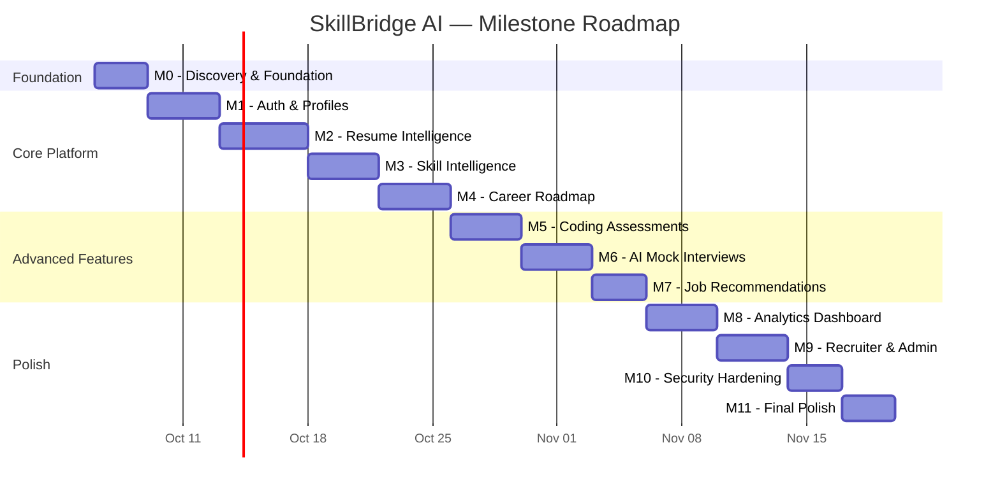

# Milestone Plan — SkillBridge AI

> **Document ID:** MILE-001
> **Version:** 1.0.0
> **Created:** 2026-10-06
> **Status:** Active

---

## Milestone Overview

---

## M0 — Discovery & Engineering Foundation

**Objective:** Establish project infrastructure, documentation, and development environment.

### Deliverables

| # | Deliverable | Status |
|---|-------------|--------|
| 0.1 | CLAUDE.md (Engineering Constitution) | ✅ Complete |
| 0.2 | Project analysis document | ✅ Complete |
| 0.3 | Software Requirements Specification | ✅ Complete |
| 0.4 | System architecture document | ✅ Complete |
| 0.5 | Architecture Decision Records | ✅ Complete |
| 0.6 | Database design document | ✅ Complete |
| 0.7 | API design document | ✅ Complete |
| 0.8 | Test plan | ✅ Complete |
| 0.9 | Milestone plan (this document) | ✅ Complete |
| 0.10 | UML diagrams | ✅ Complete |
| 0.11 | Git repository initialized | 🔲 Pending |
| 0.12 | Project scaffolding (client + server) | 🔲 Pending |
| 0.13 | Docker Compose setup | 🔲 Pending |
| 0.14 | ESLint + Prettier configuration | 🔲 Pending |
| 0.15 | CI pipeline skeleton | 🔲 Pending |
| 0.16 | README.md | 🔲 Pending |
| 0.17 | .env.example | 🔲 Pending |
| 0.18 | Database connection + Prisma setup | 🔲 Pending |

### Acceptance Criteria

- [ ] All documentation artifacts exist and are coherent
- [ ] Git repository is initialized with proper .gitignore
- [ ] `npm install && npm run dev` starts both client and server
- [ ] Docker Compose starts PostgreSQL and Redis
- [ ] ESLint + Prettier run without errors on scaffolded code
- [ ] Prisma connects to the database and can run migrations

---

## M1 — Authentication & Profiles

**Objective:** Implement secure user authentication with RBAC and profile management.

### Deliverables

| # | Deliverable |
|---|-------------|
| 1.1 | User registration endpoint (email, password, name, role) |
| 1.2 | Password hashing (bcrypt, 12 rounds) |
| 1.3 | Login endpoint with JWT issuance |
| 1.4 | Refresh token flow (httpOnly cookie) |
| 1.5 | Logout with server-side token invalidation |
| 1.6 | Auth middleware (JWT verification) |
| 1.7 | RBAC middleware (role-based route protection) |
| 1.8 | Rate limiting on auth endpoints |
| 1.9 | Account lockout after 5 failed attempts |
| 1.10 | Student profile CRUD |
| 1.11 | Education & experience records CRUD |
| 1.12 | Career goals CRUD |
| 1.13 | Recruiter profile CRUD |
| 1.14 | Frontend: Login / Register pages |
| 1.15 | Frontend: Profile management page |
| 1.16 | Frontend: Protected route system |
| 1.17 | Prisma schema for users, profiles, roles |
| 1.18 | Database migrations and seed (roles) |
| 1.19 | Unit tests for auth service |
| 1.20 | Integration tests for all auth endpoints |
| 1.21 | Integration tests for all profile endpoints |

### Acceptance Criteria

- [ ] User can register, login, and logout
- [ ] JWT access tokens expire in 15 minutes
- [ ] Refresh tokens are httpOnly cookies
- [ ] RBAC blocks students from admin routes
- [ ] Account locks after 5 failed login attempts
- [ ] Rate limiting rejects > 5 auth requests/minute/IP
- [ ] Profile CRUD works for students and recruiters
- [ ] All auth tests pass with ≥90% coverage
- [ ] No passwords appear in logs or responses
- [ ] Security headers present on all responses

---

## M2 — Resume Intelligence

**Objective:** Build the resume upload, parsing, AI analysis, and job-matching pipeline.

### Deliverables

| # | Deliverable |
|---|-------------|
| 2.1 | File upload endpoint (PDF/DOCX, max 5MB) |
| 2.2 | File validation (type, size, malicious content) |
| 2.3 | Text extraction (PDF and DOCX parsing) |
| 2.4 | AI Service — centralized OpenAI integration |
| 2.5 | Resume analysis prompts (versioned templates) |
| 2.6 | Section detection (contact, education, experience, skills, projects) |
| 2.7 | Skill extraction from resume text |
| 2.8 | ATS-oriented scoring engine |
| 2.9 | Improvement recommendation generation |
| 2.10 | Job description matching endpoint |
| 2.11 | Match scoring with explanation |
| 2.12 | AI response validation and error handling |
| 2.13 | Graceful degradation when AI is unavailable |
| 2.14 | Frontend: Resume upload UI |
| 2.15 | Frontend: Analysis results display |
| 2.16 | Frontend: Job matching interface |
| 2.17 | Prisma schema for resumes, analyses, matches |
| 2.18 | Unit tests for scoring, validation, parsing |
| 2.19 | Integration tests for upload, analyze, match endpoints |

### Acceptance Criteria

- [ ] PDF and DOCX files upload and parse correctly
- [ ] Invalid files are rejected with clear errors
- [ ] Resume analysis returns scores and recommendations
- [ ] Job matching returns match score with breakdown
- [ ] AI service failure shows honest error (no fake results)
- [ ] All resume-related tests pass
- [ ] AI responses are validated before use

---

## M3 — Skill Intelligence

**Objective:** Implement skill taxonomy, skill extraction, and gap analysis.

### Deliverables

| # | Deliverable |
|---|-------------|
| 3.1 | Skill taxonomy data model and seeding |
| 3.2 | Target roles data model and seeding |
| 3.3 | Role-to-skill mapping |
| 3.4 | User skill management (from resume + manual) |
| 3.5 | Skill gap analysis engine |
| 3.6 | Skill prioritization algorithm |
| 3.7 | Frontend: Skill inventory view |
| 3.8 | Frontend: Skill gap visualization |
| 3.9 | Frontend: Target role selection |
| 3.10 | Unit tests for gap analysis and prioritization |
| 3.11 | Integration tests for skill endpoints |

---

## M4 — Career Roadmap

**Objective:** Generate and track personalized career roadmaps.

### Deliverables

| # | Deliverable |
|---|-------------|
| 4.1 | Roadmap generation service (AI-powered) |
| 4.2 | Roadmap data model and endpoints |
| 4.3 | Roadmap item progress tracking |
| 4.4 | Roadmap adaptation based on progress |
| 4.5 | Frontend: Roadmap visualization (timeline) |
| 4.6 | Frontend: Progress tracking interface |
| 4.7 | Tests for roadmap generation and tracking |

---

## M5 — Coding Assessments

**Objective:** Build a coding assessment engine with evaluation and analytics.

### Deliverables

| # | Deliverable |
|---|-------------|
| 5.1 | Question bank data model |
| 5.2 | Assessment CRUD endpoints |
| 5.3 | Test case evaluation engine |
| 5.4 | Submission tracking with timing |
| 5.5 | Performance analytics computation |
| 5.6 | Frontend: Assessment browser |
| 5.7 | Frontend: Code editor / answer interface |
| 5.8 | Frontend: Analytics dashboard |
| 5.9 | Seed data: sample questions and test cases |
| 5.10 | Tests for evaluation engine |

---

## M6 — AI Mock Interviews

**Objective:** Implement AI-powered mock interview system with feedback.

### Deliverables

| # | Deliverable |
|---|-------------|
| 6.1 | Interview session management |
| 6.2 | AI question generation (role + difficulty) |
| 6.3 | Response evaluation (AI-powered) |
| 6.4 | Structured feedback generation |
| 6.5 | Improvement plan generation |
| 6.6 | Interview history tracking |
| 6.7 | Frontend: Interview interface |
| 6.8 | Frontend: Feedback review |
| 6.9 | Tests for interview flow |

---

## M7 — Job/Internship Recommendations

**Objective:** Build explainable job recommendation engine.

### Deliverables

| # | Deliverable |
|---|-------------|
| 7.1 | Job listing data model and CRUD |
| 7.2 | Skill-based matching algorithm |
| 7.3 | Recommendation scoring with explanation |
| 7.4 | Frontend: Job listings browser |
| 7.5 | Frontend: Recommendation cards with explanations |
| 7.6 | Seed data: sample job listings |
| 7.7 | Tests for matching algorithm |

---

## M8 — Analytics Dashboard

**Objective:** Build the career intelligence dashboard with meaningful metrics.

### Deliverables

| # | Deliverable |
|---|-------------|
| 8.1 | Dashboard data aggregation service |
| 8.2 | Career readiness score computation |
| 8.3 | Progress metrics across all modules |
| 8.4 | Next action recommendation engine |
| 8.5 | Frontend: Dashboard layout |
| 8.6 | Frontend: Charts and visualizations |
| 8.7 | Frontend: Selective 3D/advanced visualizations |
| 8.8 | Tests for metric calculations |

---

## M9 — Recruiter & Admin Panels

**Objective:** Implement recruiter candidate search and admin management.

### Deliverables

| # | Deliverable |
|---|-------------|
| 9.1 | Recruiter: candidate search and filtering |
| 9.2 | Recruiter: shortlist management |
| 9.3 | Admin: user management |
| 9.4 | Admin: content management (skills, assessments) |
| 9.5 | Admin: audit log viewer |
| 9.6 | Notification system |
| 9.7 | Frontend: Recruiter portal |
| 9.8 | Frontend: Admin panel |
| 9.9 | Tests for recruiter and admin endpoints |

---

## M10 — Security Hardening

**Objective:** Comprehensive security audit and hardening.

### Deliverables

| # | Deliverable |
|---|-------------|
| 10.1 | Security audit execution |
| 10.2 | `docs/audits/security-privacy-audit.md` |
| 10.3 | Fix all critical/high findings |
| 10.4 | Dependency vulnerability audit |
| 10.5 | Input validation comprehensive review |
| 10.6 | Security test suite execution |
| 10.7 | Performance testing and optimization |
| 10.8 | Accessibility review |

---

## M11 — Final Product Polish

**Objective:** UI/UX refinement, final documentation, deployment readiness.

### Deliverables

| # | Deliverable |
|---|-------------|
| 11.1 | UI/UX refinement and consistency pass |
| 11.2 | Loading states, error states, empty states |
| 11.3 | Responsive design verification |
| 11.4 | CHANGELOG.md |
| 11.5 | Final README.md |
| 11.6 | Deployment guide |
| 11.7 | `docs/audits/cicd-reproducibility-audit.md` |
| 11.8 | E2E test suite completion |
| 11.9 | Final traceability matrix |
| 11.10 | Production Docker build verification |
| 11.11 | Demo data seeding script |
| 11.12 | Final acceptance checklist |

---

## Milestone Control Protocol

After each milestone:

1. ✅ Run all tests
2. ✅ Review implementation against acceptance criteria
3. ✅ Update documentation
4. ✅ Produce milestone report
5. ✅ Identify remaining issues
6. ⏸️ **Present milestone as complete and wait for approval**
7. ➡️ Begin next milestone only after approval
