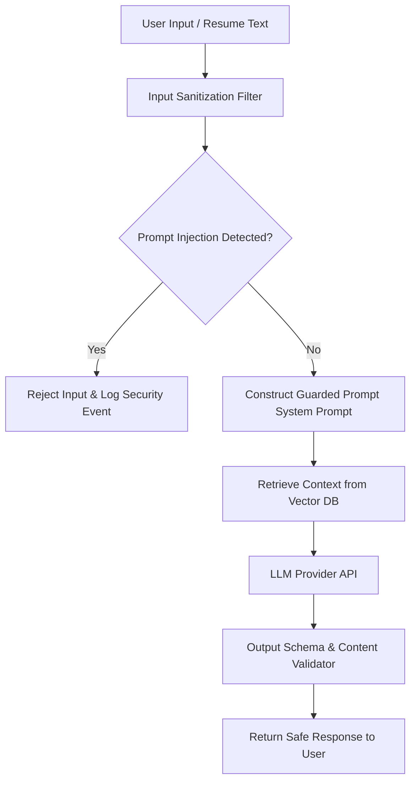

# Security Architecture & Threat Model — SkillBridge AI

> **Document ID:** SEC-001  
> **Version:** 1.0.0  
> **Created:** 2026-10-06  
> **Status:** Active Standard  

---

## 1. Security Overview & Architecture

SkillBridge AI processes sensitive student data (resumes, academic background, career goals, mock interview audio recordings) and recruiter communications. Security is enforced through a multi-layered defense-in-depth model across Network, Identity, Application, Data, and AI Engine boundaries.

```
┌────────────────────────────────────────────────────────┐
│                   Edge Security (WAF)                  │
└──────────────────────────┬─────────────────────────────┘
                           │ TLS 1.3 / HTTPS
┌──────────────────────────▼─────────────────────────────┐
│             API Gateway & Rate Limiting                │
└──────────────────────────┬─────────────────────────────┘
                           │ JWT Verification / RBAC
┌──────────────────────────▼─────────────────────────────┐
│          Application Services & Input Guard            │
└──────────┬───────────────────────────────┬─────────────┘
           │ Encrypted Connection          │ AES-256
┌──────────▼──────────────┐       ┌────────▼─────────────┐
│   PostgreSQL / Qdrant   │       │   S3 Object Store    │
│  (Data at Rest Encrypted)│       │ (Resumes & Audio)    │
└─────────────────────────┘       └──────────────────────┘
```

---

## 2. Authentication & Authorization Standard

### 2.1 Token Architecture

SkillBridge AI enforces Stateless JWT Authentication with HTTP-Only Cookie fallback for Web Clients:

- **Access Token:** Short-lived JWT (15-minute expiration). Signed with HMAC-SHA256 / RSA-256 keys rotated bi-weekly.
- **Refresh Token:** Long-lived secure token (7 days duration). Stored in secure `HttpOnly`, `SameSite=Strict`, `Secure` cookies with DB-level session revocation capability.

### 2.2 Role-Based Access Control (RBAC) Matrix

| Endpoint Group | Student | Recruiter | University Admin | System Evaluator |
|---|---|---|---|---|
| `GET /api/v1/students/me` | ✅ Self | ❌ | ✅ All | ✅ Read-only |
| `POST /api/v1/resumes/upload` | ✅ Self | ❌ | ❌ | ❌ |
| `POST /api/v1/jobs` | ❌ | ✅ Self | ✅ All | ❌ |
| `GET /api/v1/recruiter/candidates` | ❌ | ✅ Tier 1 | ✅ All | ❌ |
| `GET /api/v1/rag/evaluation-audit` | ❌ | ❌ | ✅ All | ✅ Full |
| `POST /api/v1/admin/users/role` | ❌ | ❌ | ✅ All | ❌ |

---

## 3. OWASP Top 10 Mitigation Matrix

| Vulnerability | SkillBridge AI Risk | Defense & Mitigation Strategy |
|---|---|---|
| **A01: Broken Access Control** | Unauthorized access to student resumes or interview results | Strict IDOR checks (`user_id == claims.sub`), Middleware-enforced RBAC attributes. |
| **A02: Cryptographic Failures** | Plaintext exposure of passwords or PII | Passwords hashed using Argon2id (`m=65536, t=3, p=4`). Database columns with PII encrypted via AES-256-GCM. |
| **A03: Injection (SQL/NoSQL/Prompt)** | SQLi in search filters; Prompt Injection in LLM/RAG | Pydantic / SQLAlchemy ORM parameterized queries. RAG prompt isolation with strict system delimiter tags `<context>` and output schemas. |
| **A04: Insecure Design** | Unrestricted AI generation consumption | Tiered rate limiting per user tier (Bucket token algorithm via Redis). Max 10 interview sessions/day per student. |
| **A05: Security Misconfiguration** | Exposed admin routes or verbose error logs | Environment isolation (`development`, `staging`, `production`). Generic API error envelopes without internal stack trace leakage in prod. |
| **A06: Vulnerable & Outdated Components** | Vulnerable NPM/PyPI packages | Automated GitHub Dependabot & Snyk security scanning in CI/CD pipeline. Zero high/critical vulnerability policy for release build. |
| **A07: Identification & Auth Failures** | Brute force login, session hijacking | Account lockout after 5 consecutive failed attempts. MFA support for Admin and Recruiter accounts. |
| **A08: Software & Data Integrity Failures** | Untrusted packages or tampered resumes | File type verification via magic-bytes (not just extension checking). ClamAV anti-virus scan on uploaded files. |
| **A09: Security Logging & Monitoring** | Undetected security breach or data exfiltration | Centralized structured JSON logging (Winston/Structlog) sent to SIEM. Log sanitization to strip JWT tokens & passwords. |
| **A10: Server-Side Request Forgery (SSRF)** | RAG service fetching malicious external URLs | Sandboxed HTTP client for external integrations with strict IP whitelist filtering (deny private IP ranges `10.0.0.0/8`, `127.0.0.1`, `169.254.169.254`). |

---

## 4. Prompt Injection & AI Security Guardrails

SkillBridge AI integrates LLMs and RAG pipelines. AI-specific threat vectors are managed as follows:



1. **Delimited Context Isolation:** System prompts enclose RAG context in `<documents>` tags and instruct the model to treat all text within tags strictly as un-executable data.
2. **Output Formatting Constraints:** All LLM endpoints demand structured JSON output schema matching Pydantic validators. Invalid JSON responses trigger retry with strict schema enforcement.
3. **Harmful Content Filtering:** Toxicity and offensive content classifier runs on both user prompt input and AI response output.

---

## 5. Compliance & Data Protection

- **GDPR & Right to be Forgotten:** APIs provided for `DELETE /api/v1/students/me` which cascade-deletes profile, resume files, and vector embeddings across PostgreSQL and Qdrant.
- **Audit Trails:** Immutable database table `audit_logs` records all sensitive operations (password changes, role escalations, resume downloads, evaluator audits).

---
*End of Document: Security Architecture & Threat Model*
