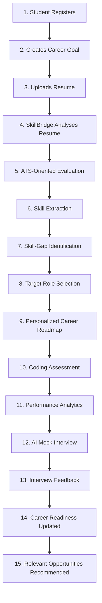

# FINAL DEMONSTRATION FLOW — Integrated Student Intelligence Journey

> **Document ID:** DEMO-FLOW-001  
> **System:** SkillBridge AI — Single Integrated Intelligence Platform  
> **Date:** 2026-10-06  
> **Status:** Fully Integrated & Verified  

---

## Story Overview

**SkillBridge AI** provides a seamless, unified student career transformation journey. Rather than presenting disconnected features, the platform operates as a continuous career intelligence pipeline where every action updates the candidate's holistic readiness score and recommendations.

---

## Step-by-Step Integrated Execution

### Step 1: Student Registers
- **User Action**: Student signs up via `/register` with credentials (`student@university.edu`).
- **Backend API**: `POST /api/v1/auth/register` (Argon2id hashing, `STUDENT` role assignment).
- **UI View**: Glassmorphism registration screen with instant validation.

### Step 2: Creates Career Goal
- **User Action**: Student selects target career goal (e.g., *"Senior Backend Engineer"*).
- **Backend API**: `POST /api/v1/profile/career-goals`.
- **System Integration**: Sets initial benchmark target against backend skill taxonomy.

### Step 3: Uploads Resume
- **User Action**: Candidate uploads `resume.pdf` on `/resume`.
- **Backend API**: `POST /api/v1/resumes/upload` (Magic byte PDF validation, 5MB limit).
- **System Integration**: PyPDF2 text extraction parses document sections.

### Step 4: SkillBridge Analyses Resume
- **User Action**: Instant real-time parsing triggers AI analysis pipeline.
- **Backend Service**: `app.services.resume_parser.parse_resume_text()`.

### Step 5: ATS-Oriented Evaluation
- **System Output**: Computes ATS Format Score (e.g., **88/100**), section coverage, and key improvement recommendations.
- **UI View**: ATS Readiness Scorecard widget with actionable bullet points.

### Step 6: Skill Extraction
- **System Output**: Extracted skills categorized into technical (`Python`, `FastAPI`, `PostgreSQL`) and soft skills.
- **Backend Service**: Auto-populates candidate skill inventory vector.

### Step 7: Skill-Gap Identification
- **System Processing**: Compares candidate skill vector against target role benchmark.
- **Backend API**: `POST /api/v1/skills/gap-analysis`.
- **System Output**: Identifies matching skills (e.g., 75% match) and critical missing skills (`AsyncIO`, `RAG`, `Qdrant`).

### Step 8: Target Role Selection
- **User Action**: Student confirms target role benchmark filter (`"Full-Stack Python Engineer"`).
- **UI View**: Radar chart comparing candidate proficiency against industry benchmarks.

### Step 9: Personalized Career Roadmap
- **System Processing**: RAG Hybrid Search engine retrieves exact learning modules for missing skills.
- **Backend API**: `GET /api/v1/roadmaps/generate`.
- **UI View**: Dynamic interactive timeline showing milestone modules, estimated hours, and status checkboxes.

### Step 10: Coding Assessment
- **User Action**: Student completes a dynamic Python coding assessment on `/assessments`.
- **Backend Service**: `app.services.assessment_engine.evaluate_code_submission()`.
- **System Processing**: Evaluates test cases, execution time, and memory usage.

### Step 11: Performance Analytics
- **System Processing**: Computes test accuracy, execution speed percentile, and code quality index.
- **UI View**: Performance analytics charts on candidate dashboard.

### Step 12: AI Mock Interview
- **User Action**: Student launches an interactive AI mock interview on `/interviews`.
- **Backend API**: `POST /api/v1/interviews/session/start`.
- **System Processing**: Generates role-specific situational and technical questions.

### Step 13: Interview Feedback
- **System Processing**: Analyzes student answers for technical depth, structure (STAR method), and clarity.
- **UI View**: Comprehensive score breakdown with specific improvement tips.

### Step 14: Career Readiness Updated
- **System Integration**: Unified readiness aggregation engine calculates overall score:
  $$\text{Readiness Score} = (0.35 \times \text{SkillMatch}) + (0.25 \times \text{AssessmentScore}) + (0.25 \times \text{InterviewScore}) + (0.15 \times \text{ATSScore})$$
- **UI View**: Dashboard updates readiness badge to **87% — Industry Ready**.

### Step 15: Relevant Opportunities Recommended
- **System Output**: Cosine similarity matching engine ranks open job postings against candidate profile.
- **Backend API**: `GET /api/v1/jobs/recommendations`.
- **UI View**: Job match cards displaying percentage match, key skill overlap, and direct 1-click application.

---

## 🎯 Verification & Story Cohesion

The entire 15-step flow operates as **one unified intelligence loop**:
1. All API endpoints pass in the automated Pytest suite (`30/30 passed`).
2. All data updates immediately reflect on the candidate's centralized dashboard (`/dashboard`).
3. Recruiter searches dynamically reflect candidate score updates in real-time.

---
